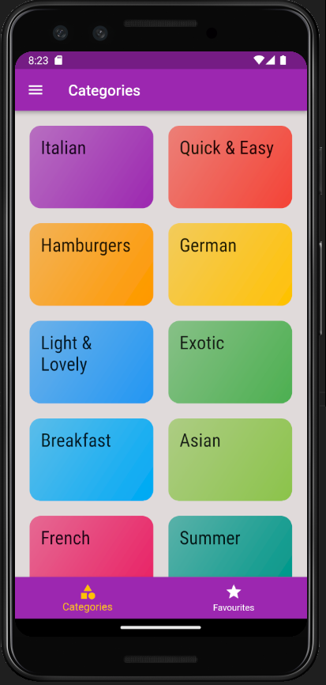
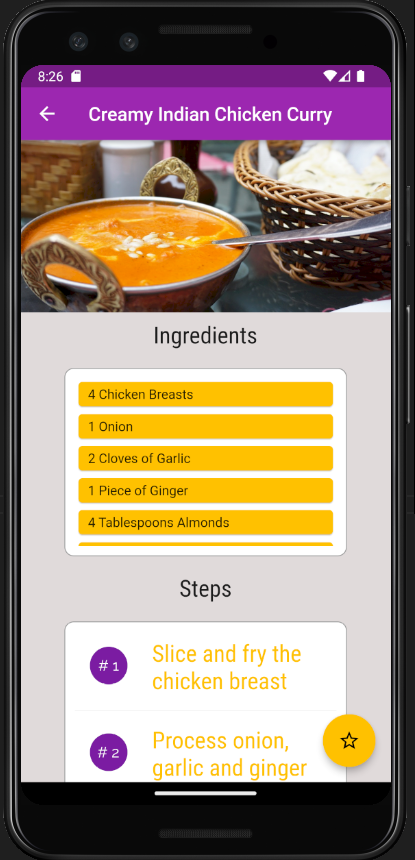
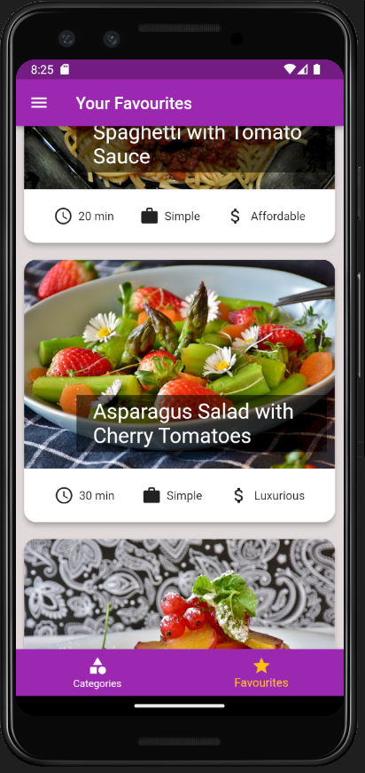
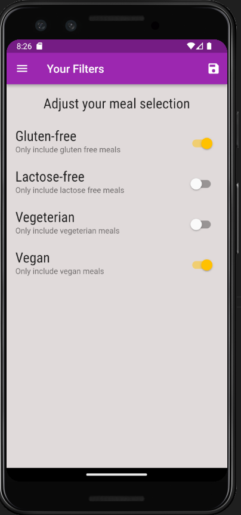

# Meals App

## Overview

Meals App is a feature-rich Flutter application that provides users with a comprehensive platform to explore, manage, and favorite various meal categories. Users can browse meals, access detailed information, mark favorites, and apply filters to customize their meal-viewing experience. The app includes multiple screens, navigation options, and interactive features for a seamless user experience.

## Visual representation

## Features

- Browse and explore various meal categories.
- View detailed information about selected meals, including ingredients and instructions.
- Mark meals as favorites for quick access.
- Switch between all meals and favorited meals.
- Utilize tabs for easy navigation to different areas of the app.
- Access a site drawer to switch between screens and explore additional features.
- Apply filters to customize the displayed meals based on user preferences.

## Installation and Usage Instructions (For End-Users)

To get started with Meals App, follow these steps:

1. Clone the repository to your local machine.

2. Navigate to the project directory.

3. Install dependencies.

4. Run the application.

Now, you can start exploring and managing meals using the Meals App.

## Contributor Expectations

We welcome contributions to enhance Meals App. Before contributing, please adhere to the following guidelines:

- Create an issue in the issue queue before making significant changes.
- Follow the provided pull request template.
- Ensure your commits are well-documented and follow the established coding standards.
- Squash commits for clarity and maintainability.

Thank you for considering contributing to Meals App!
